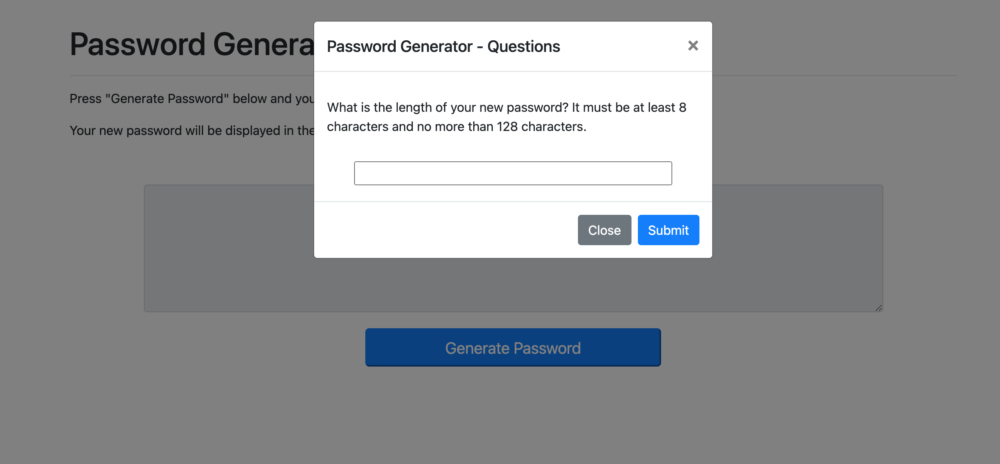
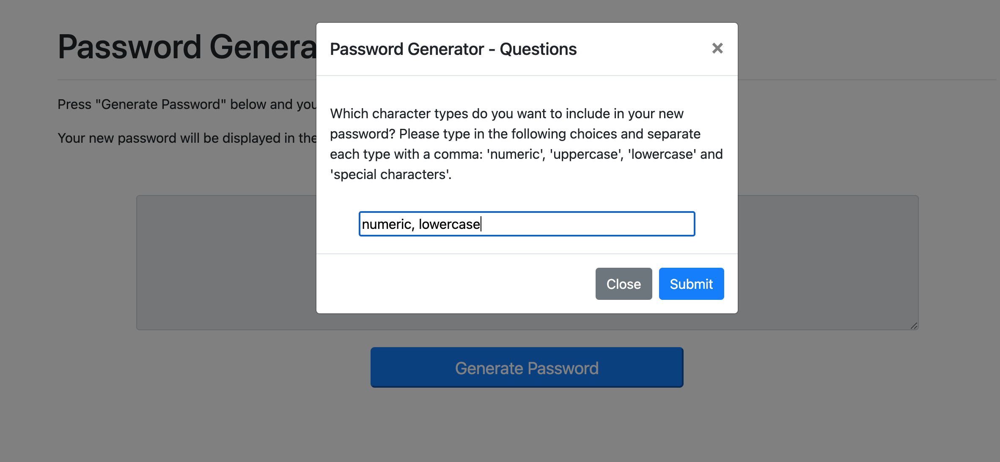
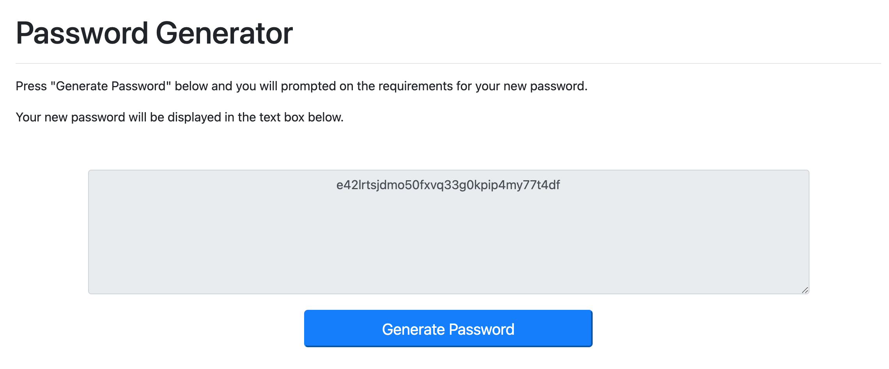

# Password Generator

Password Generator is a web application that generates a random password based on user-selected criteria. When you click the button to generate the passsword, the app will ask you to specify the length of your password, and the character types you want to use. 

User input will be validated by the app and an alert will be shown if you leave any prompts blank or request a password length less than 8 or greater than 128. The finished password will display in the text input above the button.

## User Story

```
AS AN employee with access to sensitive data
I WANT to randomly generate a password that meets certain criteria
SO THAT I can create a strong password that provides greater security
```

## Instructions on How to Generate a Password

1. Press "Generate Password" and a modal will appear to ask you for the password length. You must enter a number from 8 to 128.



2. Press "Submit" to go onto the next prompt. A new question will appear asking for the character types you want to include in your password. You must enter the character types exactly as the options are presented and each option you choose must be separated by a comma as seen below.



3. After you submit the last question, the modal will close and your new password will generate in the text area field as shown below.


